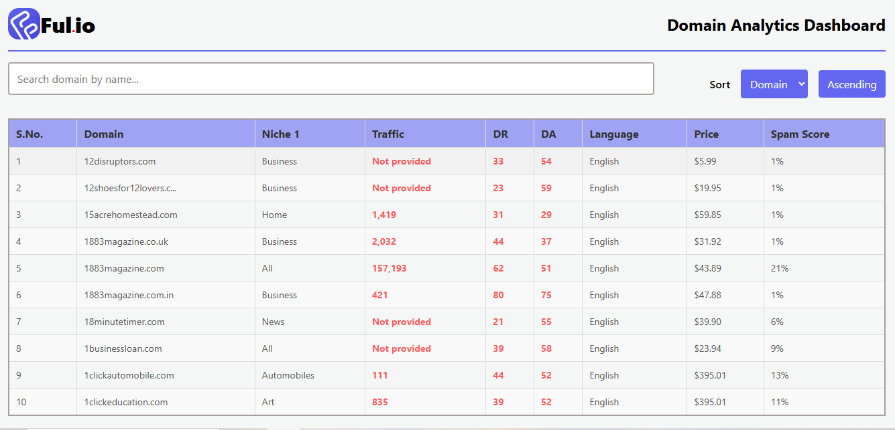

# Domains Analyzer

Domains Analyzer is a web-based application that allows users to manage and analyze domain data effectively. It provides features like sorting, filtering, and displaying domain information retrieved from a PostgreSQL database. The backend is deployed on Render, and the frontend is built using React.

---

**Link:** https://domainanalyzerclient.onrender.com

## Features

- **Sorting**: Sort table columns like Traffic, DR, DA, etc.
- **Filtering**: Search and filter domains by "Domain Name".
- **Responsive Design**: A user-friendly interface that works across devices.
- **Integration**: Fetches data from the PostgreSQL database via an Axios-based API.
- **Error Handling**: Displays meaningful error messages for better debugging.

---

## Technologies Used

### Frontend
- **React**: Frontend library for building UI components.
- **Axios**: HTTP client for API requests.
- **CSS**: Styling for the responsive and interactive design.

### Backend
- **Node.js**: JavaScript runtime for backend logic.
- **Express**: Web framework for building APIs.
- **PostgreSQL**: Relational database for storing domain data.

### Deployment
- **Render**: Platform for hosting the backend API and Frontend.

